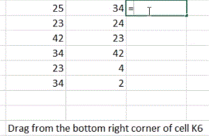
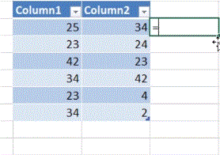
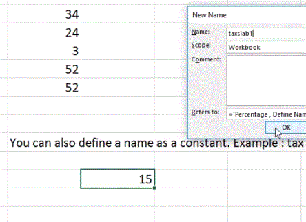
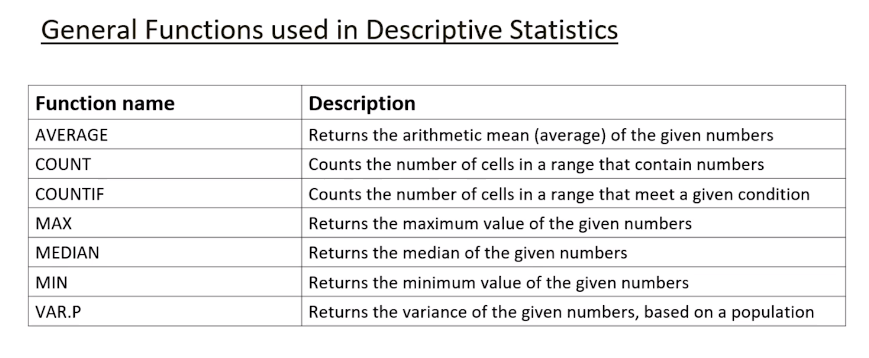

## Basic Functions

- Most commonly used functions in excel are:

  - Addition (+)

    > Types of Addition

    - = 34 + 34
    - = A7 + B5
    - = A7 + B5 + 34
    - Using cell name and function. -> = A1-Sum(A2:A9)
    - Drag corner to generalize formula.
      
    - Make table and define formula.

      

  - Subtraction (-)
  - Multiplication (\*)
  - Division (/)
  - Power(^)
    > Power & Square root function
    - Using power symbol (^) -> A1^2
    - Using power symbol -> A1^(1/2)
    - SQRT(A1) - wont work for negative numbers.
  - Percentage:
    - Using percentage symbol (%) -> A1\*50%
    - Using percentage sumbol -> A1\*(1+B1)
      - Here A1 = 50, B1 = 50%, you will get value of (A1 + 50% of A1)

> Define name

> ## General Function used in Descriptive Statistics
>
> 
