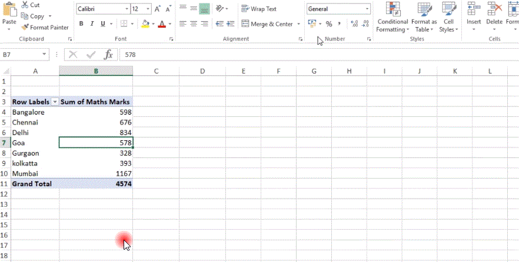

# Pivot Table

- A pivot table allows you to extract the significance from a large, detailed data set.

  - It can be used as a Data Aggregating function.
  - We can create new table using pivot.
  - Value Field setting can also be used fro making changes in functions on values.

    - Sum
    - Count
    - Average
    - Max
    - Min
    - Std
    - Var, etc

    > 

    > 

#

# Slicers

- It is used to quickly and easily filter pivot tables.

> 

> 
