# Data Cleaning

- Concatenate -> Join two string.

  - ### Using Concatenate function

    > =CONCATENATE(B8," ",C8," ",D8)

    > add space in between

    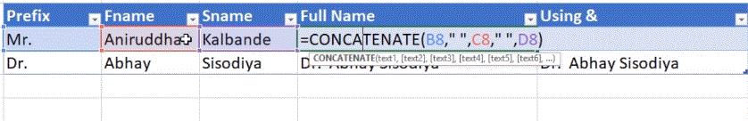

  - ### Using & operator
    > =B8 & " " & C8 & " " & D8
  - ### Concatenate Stirng and numerical

    > ="Your bill is" & B16

    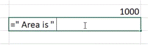

- # Left and Right

  - ### Left function returns the number of characters defined from the string from Left.

    > = LEFT(Text,no. of characters)

    > = LEFT([@Column name],3)

    > = LEFT("Text",3)

    > 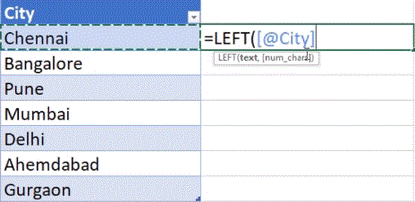

  - ### Right function returns the number of characters defined from the string from Right.

    > = RIGHT(Text,no. of characters)

    > = RIGHT([@Column name],3)

    > = RIGHT("Text",3)

    > 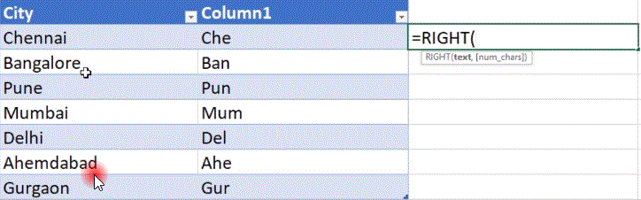

- # Mid and Trim

  - ### Mid

    > =MID("Hello world",2,5)

    > 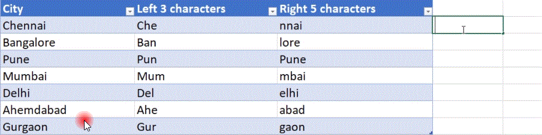

  - ### Trim -> TRIM function returns a text value with the leading and trailing spaces removed. It is also used to remove unnecessary spaces between words in a string.

    > = TRIM('Tex t')

    > = TRIM(" Hello! How are you ?? ')

    > = TRIM('Hello ! How are you ???')

    > 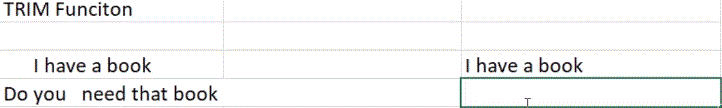

- # Uppercase and Lowercase and Proper

  - ### Lower Function converts string in lower case.

    > = LOWER("Text")

    > = LOWER("HELLO! How are You?") -> hello! how are you?

    > 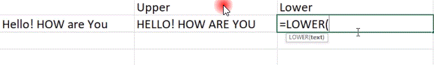

  - ### Upper Function converts string in Upper case.

    > = UPPER("Text")

    > = UPPER("HELLO! How are You?") -> HELLO! HOW ARE YOU?

    > 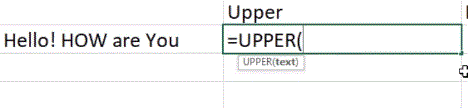

  - ### Proper Function converts string in Proper case.

    > = PROPER("Text")

    > = PROPER("HELLO! How are You?") -> Hello! How Are You?

    > 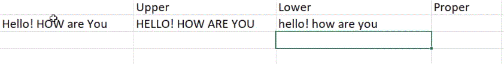

- # Find and Search

  - ### Find function is used to find position of the particular substring within a string.

    > =FIND('Find text,'within text')

    > =FIND('Hello','Hello!, How are you?') -> 1

    > = FIND('hello','Hello!, How are you?) -> error

        1. find is CASE SENSITIVE

    > 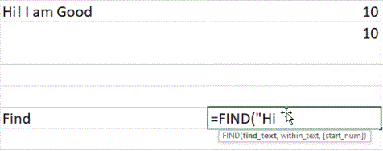

  - ### Search function is used to find substring within a string.

    > =SEARCH('Find text,'within text')

    > =SEARCH('Hello','Hello!, How are you?') -> 1

    > = SEARCH('l?o','Hello!, How are you?) -> 3

        1. ? is used as single character and * can be used as any series of characters
        2. search is INCASE SENSITIVE

    > 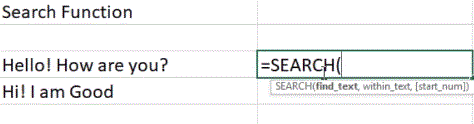

    > 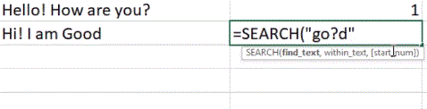

- # Substitute and Replace

  - ### Substitude -> When we know the text to be replaced.

    > SUBSTITUDE(Cell name, "old text","new text")

    > SUBSTITUDE(C1,"hi",'hello") -> hi will be replaced by hello

    > 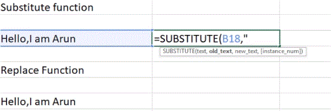

    > SUBSTITUDE(C1,"hi","hello",2) -> 2nd hi (hi) will be replaced by hello

    > CASE SENSITIVE

  - ### Replace -> When we know the position of the text to be replaced.

    > REPLACE(Cell name, start no,no. of characters,"new text")

    > REPLACE (C1,4,3,"h1") -> Starting from 4th postion ans length 3 will be replaced by hi.

    > 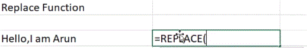

- # Len and char

  - ### LEN -> Len Function is used to calculate the lenth of the string.

    > LEN("text") -> 4

    > 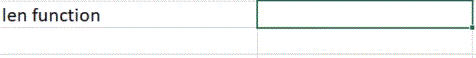

  - ### Char -> We can retrieve the character from its ASCII value.

    > CHAR(ASCII Code)

    > CHAR(65) -> A

    > 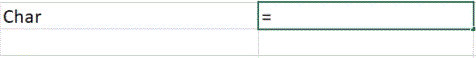

- # Round

  - ### Returns a number rounded to a given number of digits.

    > ROUND(number,number digit)

    > ROUND(6.7845,1) -> 6.8 Rounding to nearest 1 decimal place.

    > ROUND(6.7845,3) -> 6.7845 Rounding to nearest 1 decimal place.

    > ROUND(6.7845,0) -> 7 Rounding nearest to whole number.

    > ROUND(9518.5,-1) -> 9520 Rounding to nearest 10

    > ROUND(9518.5,-2) -> 9500 Rounding to nearest 100

    > ROUND(9518.5,-3) -> 10000 Rounding to nearest 1000

    > 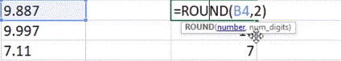

    > 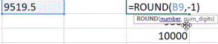

- # Floor

  - ### It rounds a given number down to the nearest specified multiple.

    > FLOOR( number,multiple )

    > 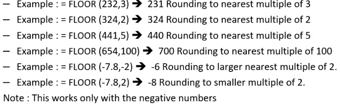

    > 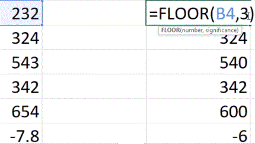

- # AND and OR

  - ### AND means when both of the conditions are TRUE.

    > = IF(AND([@MATHS]>40,[@Physics]>40),"Pass","Fail")

    > 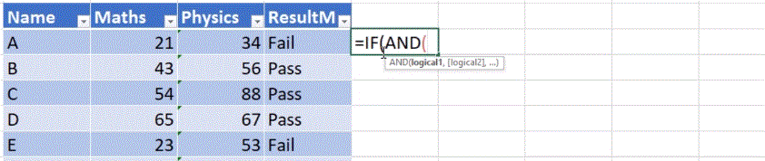

  - ### OR means when one of them is TRUE.
    > = IF(OR([@MATHS]>40,[@Physics]>40),"Pass","Fail")

- # Conditional Formating

  - ### It enables you to highlight cells with a certain color, depending on the cell's value.

    - With Highlight cells rules we can highlight cells greater/less/equal/not equal than certain value.
    - With Top/Buttom Rules we can highlight top/buttom 10% cells , etc.

    > 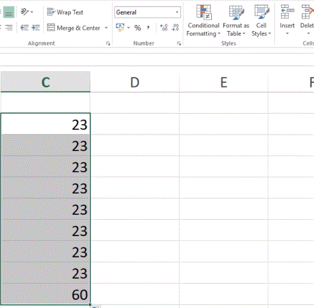
