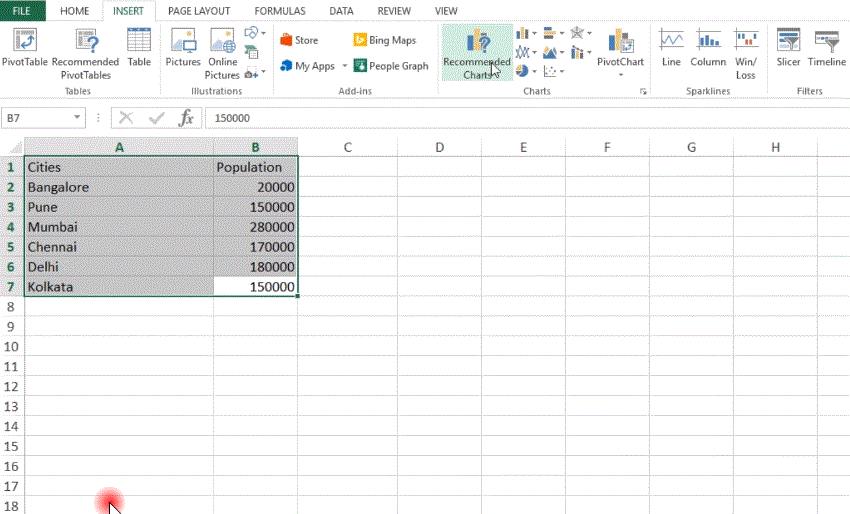
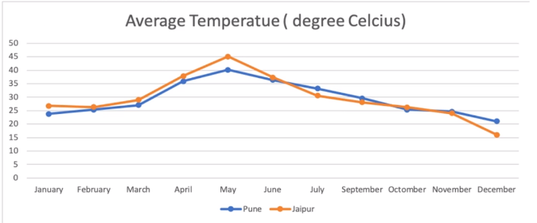
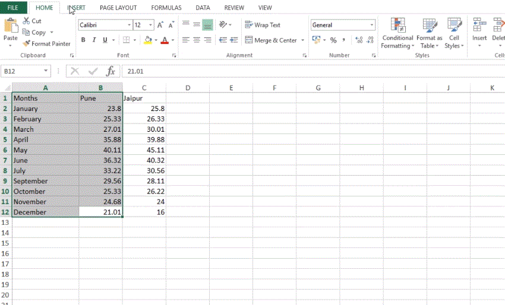

## Data Visualization

- # Bar Plot

  - It is used when we have one categorical data and one numerical data.
  - Frequently used as numerical data.

    > 

    > 

- # Pie Chart

  - It is used when we have one categorical data and one numerical data.
  - Frequently used as numerical data.

    > 

    > 

- # Line Chart

  - Line charts are used to display if you have text labels, datas or a few numeric labels on the horizontal axis.
  - Generally, Data is used as a categorical data.

    > 

    > 

- # Combination Chart

  > 

  > 

  > 

- # Scatter Plot

  - It is often used to show the relationship between two numerical parameters.

  > 

  > 

  > 

- # Pivot Charts

  - Pivot charts are use to analyze the data with in pivot table.

  > 

  > 

- # Radar Chart

  > 

  > 

- # Box Plot

- # Histogram
