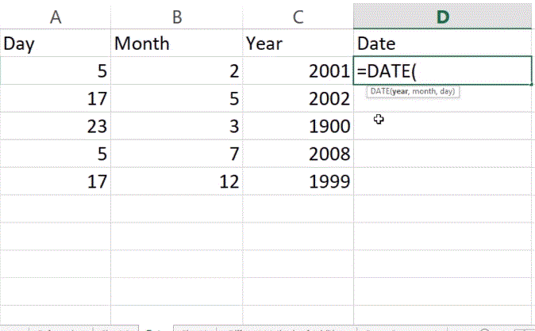

## Date and Time

- Steps to convert cell in Date and Time format
  - Select cell
  - Right click, and then click Format cells.
  - In the category list, select Date, and select a Date format.
  - Click ok.
    > Custom Date and time formats can also be created.
  - We can also use DATE(year,month,day)
    > The DATE function returns a serial date value. A serial is how Excel stores dates internally and it represents the number of days since january 1,1900.

