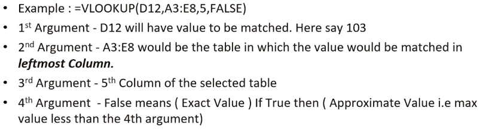
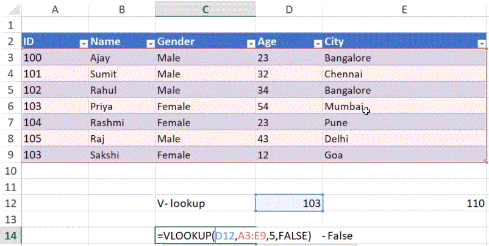
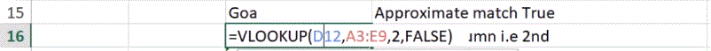
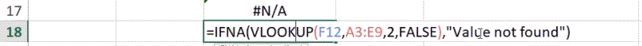
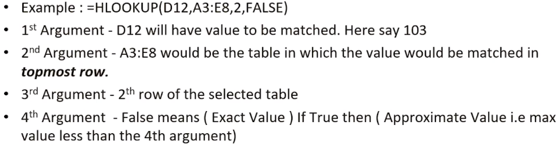
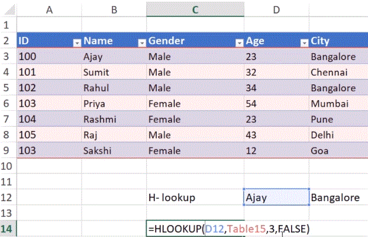
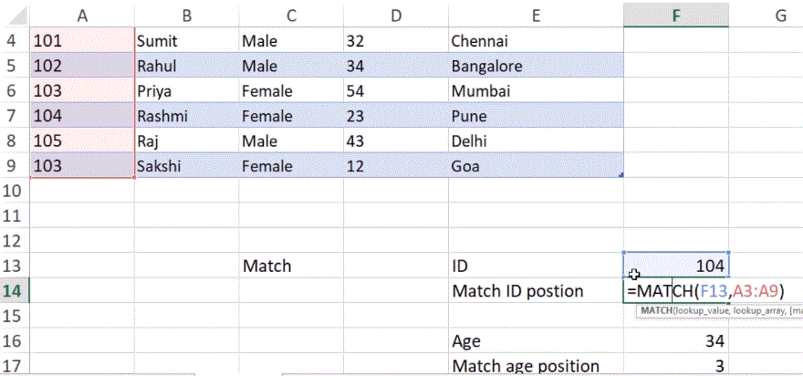

# V Lookup -> Query -> Get result from query.

- ### It is used to make a exact match or approximate match and find values from leftmost Column.
- ### Vloopup function always looks up a value in the leftmost column of a table and returns the corresponding value from a column to the right.

  - It is Case-insensitive ( a == A )

- ### In case of multiple matches it will take First Match
- ### If no value is matched it returns null.

  > = VLOOKUP(Look up value, Table Array, Column Index number, range lookup bool value)
  > 

  > 

  > 

  > 

# H Lookup

- ### It is used to make a exact match or approximate match and find values from topmost row.

  > = HLOOKUP(Look up value, Table Array, Row Index number, range lookup bool value)

  > 

  > 

# Match

- ### Returns the position of a value in a given range.

  > MATCH(lookup range,row number)

  > MATCH(A3:A9,5)

  > MATCH(value,loop up range)

  > MATCH(104,A3:A9)

  > 
