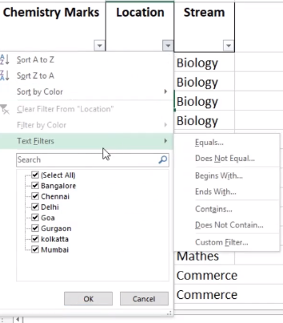
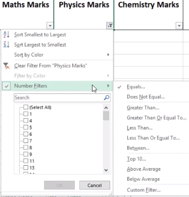
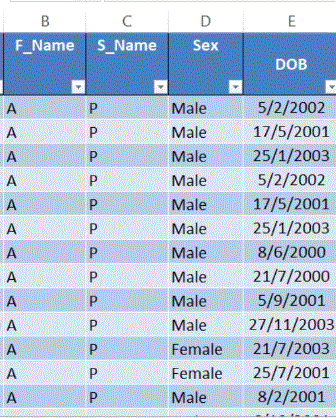
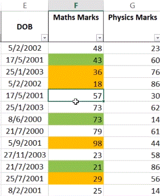

## Filtering -> Ctrl + Shift + L

- It means to fetch out data with certain similar characteristics.

  - By cell color
  - By font color
  - By value

    - By text values, alphabetically
      
    - BY numerical values (=, !=, >=, <=, <,>)
      
    - AND and OR functions.

> Filter by color

