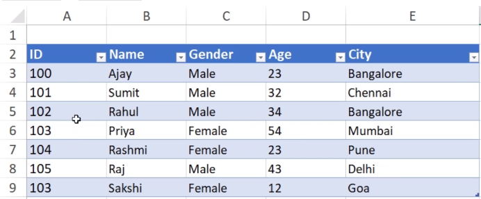
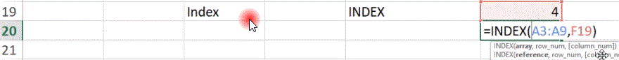
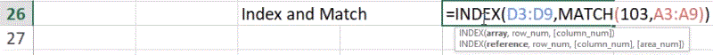
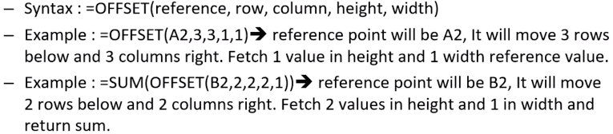
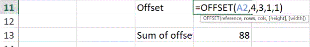

# Index

- It returns a specific value in a one-dimensional range with reference to index.

  > INDEX(lookup range, lookup index)

  > INDEX(A3:A9,F19) -> look for value of F19 index in range from A3 to A9.

  > 

  > 

#

# Index and Match

- ### To perform advance lookups we can use INDEX and MATCH function together.
- We can get index value from MATCH function and then use this value in INDEX function for getting the value.

  > INDEX(D3:D9 , MATCH(103,A3:A9)) -> Here, match function will return value of row with respect to 103 in range A3 to A9 then this will be used by Index function to lookup in 5th row of range D3 to D9.

  > 

  > 103

  > 

#

# Offset

- It returns a cell or range or cells that is a specified number of rows and column from a cell or range of cells.

  > 

  > 

  > 

#

# Dropdown

- Instead of typing you can take values from users as a list of data in the form of Dropdown menu.
  > 
