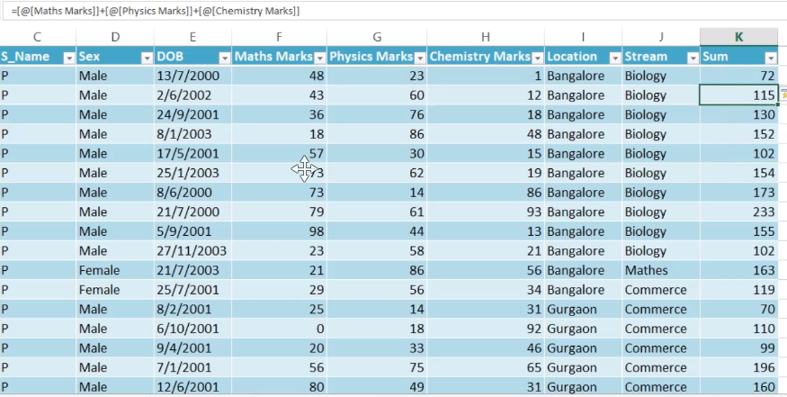

## Tables -> Ctrl + T

> ### Excel's Table command to convert a list of data into a named Excel Tabel. These tables have useful features, like sorting and filtering, to help organize and view data.

> ### To convert any data into excel table:

    - Hit insert ribbon and then hit table.
    - check or select cells of the table and hit ok

> The advantage of converting to table is a formula/function applied to a cell is applied to all column.
> 

- After converting data into table you can anytime change name and default style of your table.
